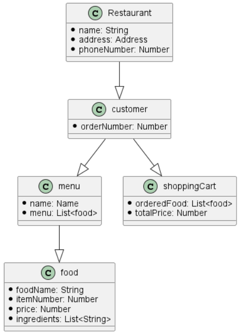
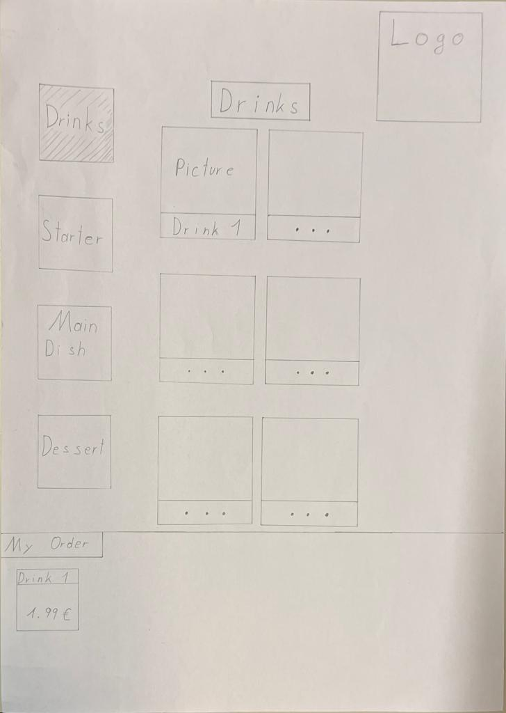

= Pick-Your-Menu

== Problem
Es gibt manchmal einige Missverständnisse zwischen dem Kellner
und der Kunde in Bezug auf das Nichtsprechen
die gleiche Sprache oder nur normales Verständnis
Probleme.

== Aufgabe
Ist eine Anwendung, die es uns ermöglicht
bestellen, was auch immer wir auf der Speisekarte vertreten wollen.
Es ist nur eine Anwendung für die Restaurants. Dass
bedeutet, dass nur Restaurants Zugriff auf die App haben.
Es ist keine mobile App für Kunden.

== Dokumente
- https://github.com/2223-3bhif-syp/02-projekte-restaurant-bestellsystem/blob/main/asciidocs/Projektauftrag.adoc[Projektauftrag]

[%collapsible]
.Programmablaufplan
====

====

== Prototyp

[%collapsible]
.Skizze
====

====