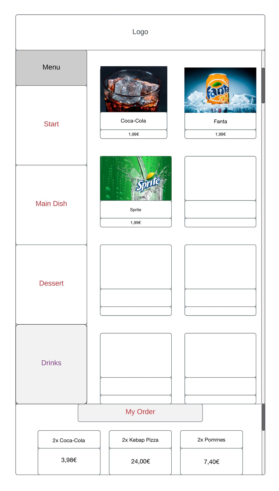
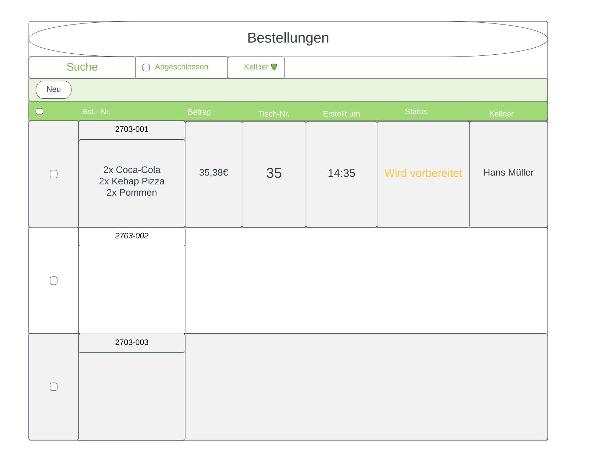

= Pflichtenheft Restaurant-Bestellsystem
:sectnums:

 Version: 1.0
 Version Date: 22.01.2023
 Autoren:
 -	Armin Salkovic
 -	Abdullah Al Desoky
 -	Balint Balazs
 -   Sukhbat Munkh

== Ausgangssituation
Die Pizzeria `Solo Pizza` bietet verschiedene Pizzen, Vorspeisen, Desserts und Getränke an.

== Ist-Zustand
Kellner werden in der Pizzeria eingesetzt, um die gewünschten Bestellungen
der Kunden aufzunehmen und um die Kunden zu bedienen.

* aktueller Vorgang
** Bestellung der Speisen/Getränke
** Servieren der Bestellung
** Konsumation
** Zahlen

== Problemstellung

* *Verständnisprobleme:* normale Verständnisprobleme zwischen Kellnern und Kunden während dem Bestellen
* *resultierende fehlerhafte Bestellungen:* Kunden sind unzufrieden, wenn ihre Bestellung nicht korrekt aufgenommen wurde.

== Aufgabenstellung
=== Funktionale Anforderungen

* Speisekarte
** Die Anwendung muss eine Speisekarte bereitstellen, in der die Kunden Angebote des Restaurants einsehen und auswählen können.

* Bestellung aufgeben
** Die Anwendung muss es Kunden ermöglichen, Bestellungen aufzugeben, um die ausgewählten Produkte zu bestellen.

==== Use-Case-Diagram

[plantuml]
----
include::./plantuml/ucd.puml[]
----

Das Entwickeln einer Anwendung, die es dem Restaurant ermöglicht, Bestellungen von Kunden aufzunehmen, indem eine intuitive
Benutzeroberfläche bereitgestellt wird.

=== Nicht-funktionale Anforderungen

* Performance
** Die Anwendung muss in der Lage sein, schnell auf Kundenanfragen zu reagieren und Bestellungen in Echtzeit aufzunehmen.

* Verfügbarkeit
** Die Anwendung muss so lange das Restaurant offen hat verfügbar sein, um Kundenbestellungen entgegenzunehmen.

* Benutzerfreundlichkeit
** Die Anwendung muss eine intuitive Benutzeroberfläche bereitstellen, die es Kunden ermöglicht, einfach und schnell Bestellungen aufzugeben.

== Ziele
* Bessere Übersicht über das Menü
* Reduzierung der Zeit für die Aufnahme von Bestellungen
* Schnellere/einfachere Entscheidungsfindung
* Schnellerer Ablauf bei der Bestellung
* Keine Missverständnisse zwischen dem Kunden und dem Personal

== Mengengerüst
* Die Anwendung wird auf einer webbasierten Plattform entwickelt
* Die Anwendung ist für die Pizzeria "Solo Pizza" zugänglich

== Rahmenbedingungen
* Das Projekt muss innerhalb eines definierten Zeitrahmens und Budgets umgesetzt werden
* Die Anwendung muss den geltenden Datenschutzgesetzen entsprechen
* Programmiersprache: Java

== Datenmodell

[plantuml]
----
include::./plantuml/dom.puml[]
----

== GUI

* GUI für den Kunden

.Bestellseite
[%collapsible]
====

====

* GUI für den Koch bzw. die Küche

.Bestellliste
[%collapsible]
====

====

== Lieferumfang
* Der Kunde erhält eine benutzerfreundliche Anwendung, über die er Bestellungen aufgeben kann. +
* Die Anwendung ermöglicht es ihm, die Speisekarten bzw. Menüs des Restaurants einzusehen und seine Bestellungen einfach und schnell aufzugeben. +
* Der Kunde erhält ebenso eine Bestätigung über erfolgreich aufgegebene Bestellungen.

== Abnahmekriterien
* Die Anwendung erfüllt alle festgelegten funktionellen Anforderungen
* Die Dokumentation der Anwendung ist vollständig und verständlich
* Die Anwendung ist stabil und fehlerfrei
* Die Anwendung ist benutzerfreundlich und intuitiv zu bedienen
* Die Anwendung hat erfolgreich die vereinbarten Tests bestanden
* Der Kunde bestätigt, dass die Anwendung seinen Erwartungen entspricht
