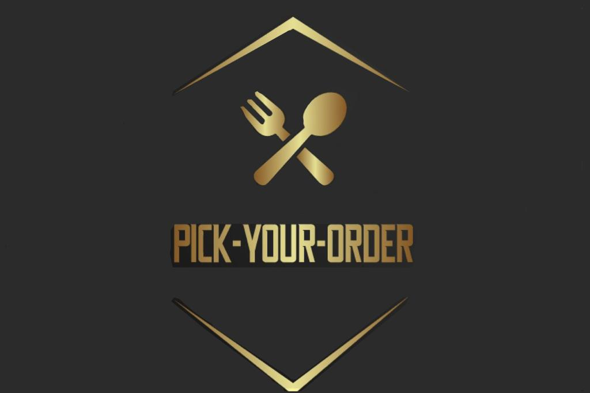

= Projektauftrag

== 

////
Team:   Armin Salkovic
        Abdullah AL Desoky
        Balint Balazs
        Sukhbat Munkh

Klasse: 3BHIF
////

== Kontakte
* Leiter: <a.salkovic@students.htl-leonding.ac.at>
* Mitglied: <a.al_desoky@students.htl-leonding.ac.at>
* Mitglied: <b.balazs@students.htl-leonding.ac.at>
* Mitglied: <s.munkh@students.htl-leonding.ac.at>

== Projektname
Pick-Your-Menu

== Auftraggeber
Herr Prof. Thomas Stütz

== Projekthintergrund
Wie wir alle wissen, gibt es manchmal
einige Missverständnisse zwischen dem Kellner
und der Kunde in Bezug auf das Nichtsprechen
die gleiche Sprache oder nur normales Verständnis
Probleme.

== Endergebis
Das Ergebnis ist eine Anwendung, die es uns ermöglicht
bestellen, was auch immer wir auf der Speisekarte vertreten wollen.
Es ist nur eine Anwendung für die Restaurants. Dass
bedeutet, dass nur Restaurants Zugriff auf die App haben.
Es ist keine mobile App für Kunden.

== Projektziel
* Bessere Übersicht über das Menü
* Schnellere/einfachere Entscheidungsfindung
* Schnellerer Ablauf bei der Bestellung
* Einfacher für das Personal
* Keine Missverständnisse zwischen dem Kunden und dem Personal

== Projektbeschreibung
* Navbar für verschiedene Kategorien (Getränke, Hauptgericht, Dessert, ...)
* Jedes Gericht/Getränk hat ein Bild davon
* Zutaten und Preise bestimmter Speisen/Getränke werden ebenfalls angezeigt
* Am Ende der Bestellung wird die Rechnung angezeigt

== Meilensteine
[cols="1,1,1,1"]
|===
^| Phase ^| Meilenstein (Ergebnis) ^| Datum ^| Veröffentlichung

| Projektstart
| -
| 07.11.2022
| -

| Projektende
| -
| (26.06.2023)
| -
|===

== Projektstart
07.11.2022

== Projektende
(26.06.2023)

== Projektressourcen
[cols="1,1,1,1"]
|===
^| Infrastruktur ^| Menge ^| Euro ^| Menge

| -
| -
| -
| -
|===

[cols="1,1,1,1"]
|===
^| Personal ^| Menge ^| Euro ^| Menge

| -
| -
| -
| -
|===

[cols="1,1,1,1"]
|===
^| Material ^| Menge ^| Euro ^| Menge

| -
| -
| -
| -
|===

[cols="1,1,1,1"]
|===
^| andere Ausgaben ^| Menge ^| Euro ^| Menge

| -
| -
| -
| -
|===

== Projektrisiken
* Nicht genug Zeit
* Missverständnisse im Team

== Projektorganisation
* Projektleiter
** Armin Salkovic
* Projektteam
** Abdullah AL Desoky
** Balint Balazs
** Sukhbat Munkh

== Fertigstellung des Projektes
-

